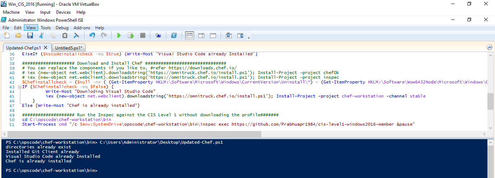
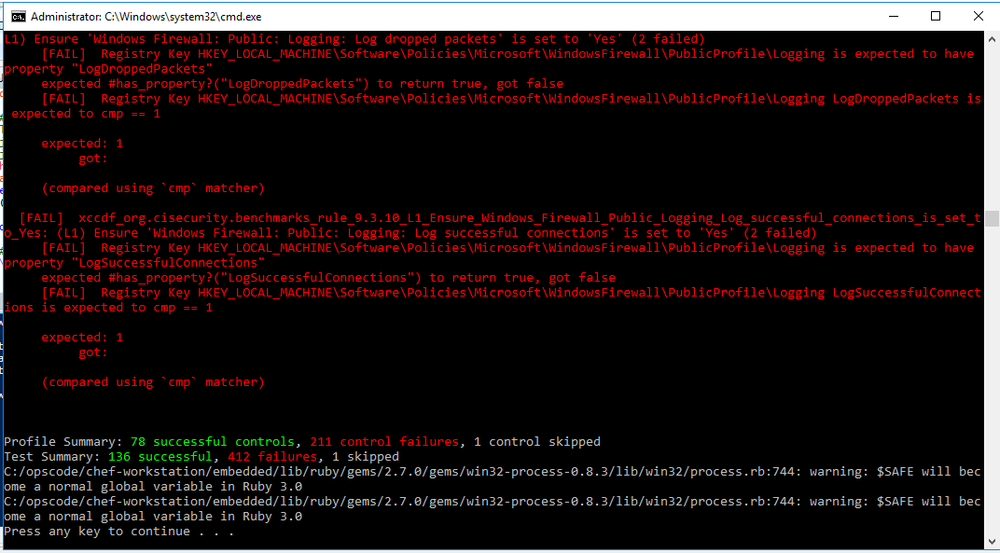

# cis-level1-windows2016-member

Chef Inspec for windows 2016 member server CIS Level 1 standards.

## Description

The CIS profile guide can be download from [CIS](https://downloads.cisecurity.org/)

## Pre-requisites

* Chef Inspec or ChefDK or Chef Workstation(which is recently released by chef) [Chef](https://downloads.chef.io/)
* WinRM Enabled (To run inspec on remote servers: https://docs.microsoft.com/en-us/windows/win32/winrm/installation-and-configuration-for-windows-remote-management)

### Supported OS Platform

- Windows 2016

## Usage

```
# run inspec profile locally without downloading and directly from Github
$ inspec exec https://github.com/Prabhuapr1984/cis-level1-windows2016-member

# clone the profile from GitHub and run locally
$ git clone https://github.com/Prabhuapr1984/cis-level1-windows2016-member
$ inspec exec cis-level1-windows2016-member

# run inspec profile on remote node
inspec exec https://github.com/Prabhuapr1984/cis-level1-windows2016-member -t winrm://<ip-address/hostname>:5985 --user=<username> --password=<password>


```
# PowerShell Script to automate

```

$ErrorActionPreference = "silentlycontinue"
$dir1 = "$env:SystemDrive\temp\inspec"
$dir2 = "$env:SystemDrive\temp\installers"
$dir3 = "$env:SystemDrive\temp\cookbooks"

If(!(test-path $dir1) -or !(test-path $dir2) -or !(test-path $dir3)) {   ForEach ($Dir in ($Dir1, $dir2, $dir3)) {New-Item -ItemType Directory -Path $Dir} }
    else{Write-Host "directories already exist"}

#################### Download and Install Git Client###########################
[Net.ServicePointManager]::SecurityProtocol = [Net.SecurityProtocolType]::Tls12
$Gitinstallcheck = ($null -ne ( (Get-ItemProperty HKLM:\Software\Microsoft\Windows\CurrentVersion\Uninstall\*) + (Get-ItemProperty HKLM:\Software\Wow6432Node\Microsoft\Windows\CurrentVersion\Uninstall\*) | Where-Object { $null -ne $_.DisplayName -and $_.Displayname.Contains('Git') }))
$GitSource = (Test-Path -Path "$env:SystemDrive\temp\installers\Git-2.27.0-64-bit.exe")
If ($Gitinstallcheck -eq $false -and $GitSource -eq $false) {
         Write-Host "Downloding Git"
         (New-Object System.Net.WebClient).DownloadFile('https://github.com/git-for-windows/git/releases/download/v2.27.0.windows.1/Git-2.27.0-64-bit.exe', "$env:SystemDrive\temp\installers\Git-2.27.0-64-bit.exe")
        }
    ElseIf ($Gitinstallcheck -eq $false) {
            Write-Host "installing Git"
            $UnattendedArgs = '/verysilent'
            (Start-Process "$env:SystemDrive\temp\installers\Git-2.27.0-64-bit.exe" $UnattendedArgs -Wait -Passthru).ExitCode
        }
ElseIf ($Gitinstallcheck -eq $true) {Write-Host "Installed Git Client already"}

#################### Download and Install Visual Studio Code####################
$Vscodeinstallcheck = ($null -ne ( (Get-ItemProperty HKLM:\Software\Microsoft\Windows\CurrentVersion\Uninstall\*) + (Get-ItemProperty HKLM:\Software\Wow6432Node\Microsoft\Windows\CurrentVersion\Uninstall\*) | Where-Object { $null -ne $_.DisplayName -and $_.Displayname.Contains('Visual Studio Code') }))
$VscodeSource = (Test-Path -Path "$env:SystemDrive\temp\installers\vscode-stable.exe")
If ($Vscodeinstallcheck -eq $false -and $VscodeSource -eq $false) {
         Write-Host "Downloding Visual Studio Code"
         Invoke-WebRequest -Uri https://vscode-update.azurewebsites.net/latest/win32/stable -OutFile $env:SystemDrive\temp\installers\vscode-stable.exe
    }
ElseIf ($Vscodeinstallcheck -eq $false) {
        Write-Host "Installing Visual Studio Code"
        $UnattendedArgs = '/verysilent /suppressmsgboxes /mergetasks=!runcode'
        (Start-Process "$env:SystemDrive\temp\installers\vscode-stable.exe" $UnattendedArgs -Wait -Passthru).ExitCode
    }
ElseIf ($Vscodeinstallcheck -eq $true) {Write-Host "Visual Studio Code already Installed"}

#################### Download and Install Chef ###############################
# You can replace the components if you like to, #refer https://downloads.chef.io/
# iex (new-object net.webclient).downloadstring('https://omnitruck.chef.io/install.ps1'); Install-Project -project chefDk
# iex (new-object net.webclient).downloadstring('https://omnitruck.chef.io/install.ps1'); Install-Project -project inspec
$Chefinstallcheck = ($null -ne ( (Get-ItemProperty HKLM:\Software\Microsoft\Windows\CurrentVersion\Uninstall\*) + (Get-ItemProperty HKLM:\Software\Wow6432Node\Microsoft\Windows\CurrentVersion\Uninstall\*) | Where-Object { $null -ne $_.DisplayName -and $_.Displayname.Contains('Chef') }))
If ($Chefinstallcheck -eq $false) {
         Write-Host "Downloding Visual Studio Code"
         iex (new-object net.webclient).downloadstring('https://omnitruck.chef.io/install.ps1'); Install-Project -project chef-workstation -channel stable
    }
Else {Write-Host "Chef is already installed"}

#################### Run the Inspec against the CIS Level 1 without downloading the profile#######
cd C:\opscode\chef-workstation\bin
Start-Process cmd "/c $env:SystemDrive\opscode\chef-workstation\bin\inspec exec https://github.com/Prabhuapr1984/cis-level1-windows2016-member &pause"

```




## Contributors

* Prabu Jaganathan [Prabhuapr1984](https://github.com/Prabhuapr1984)
